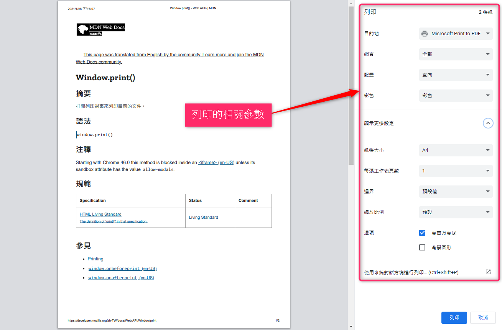

# 前端列印的那些事

雖然明年 2022 年 , 推行公司無紙化也有許多年頭了 , BUT 由於稽核 . 會計 ...等原因 , 
我們還是需要將紙本印出來 , 然後給主管簽名蓋章

身為前端人員當然有時也會被要求幫忙處理列印的相關事情 , 當我開始處理後 , 發現這個 issue 真的是不太容易的事

因此在此紀錄 , 免得自己的金魚腦 , 讓我 1 個月後忘記 `當初` 到底是如何處理的

剛開始想的時候 , 大概切分成 2 塊 , 來思考 "前端處理的部分"

- 問題一 : 如何將列印的 Panel 開啟 , 並設定要列印的目標 & 其他列印設定
- 問題二 : 如何將列印目標固定成 A4 直向 or 橫向

當然 , 如果有後端可以幫忙產 PDF 的話 , 問題二 , 就可以當不存在 , 因為可以叫後端會幫忙處理這塊 ㄎㄎ 😊

## 用 JS 開啟瀏覽器的列印介面

[MDN](https://developer.mozilla.org/zh-TW/docs/Web/API/Window/print) 上只有寫 `window.print()` 然後就沒了 !

這...

可是我希望列印目標的區塊啊!

再進一步查詢後 , 我們可以發現有個 [printJS](https://printjs.crabbly.com/) 

它可以 列印 `PDF` . `HTML` . `IMAGE` . `JSON` , 這就是我們需要的

```javascript
/*** code snippets ***/
// 列印 PDF 
printJS('docs/printjs.pdf')
printJS({printable: base64, type: 'pdf', base64: true})
printJS({printable:'docs/xx_large_printjs.pdf', type:'pdf', showModal:true})

// 列印 HTML 
printJS('printJS-form', 'html')
printJS({ printable: 'printJS-form', type: 'html', header: 'PrintJS - Form Element Selection' })

// 列印 IMAGE 
printJS('images/print-01-highres.jpg', 'image')
printJS({printable: 'images/print-01-highres.jpg', type: 'image', header: 'My cool image header'})
printJS({
    printable: ['images/print-01-highres.jpg', 'images/print-02-highres.jpg', 'images/print-03-highres.jpg'],
    type: 'image',
    header: 'Multiple Images',
    imageStyle: 'width:50%;margin-bottom:20px;'
})

// 列印 JSON 
printJS({
    printable: someJSONdata,
    properties: [
        { field: 'name', displayName: 'Full Name'},
        { field: 'email', displayName: 'E-mail'},
        { field: 'phone', displayName: 'Phone'}
    ],
    type: 'json'
})
```

太棒了 ! 可以列印指定的區塊 , 可是...列印參數要如何指定阿 ? 




1. 都丟給後端處理
2. 請後端傳輸 PDF 到前端 , 由前端打開瀏覽器的列印介面
3. 前端製作 html . css 以符合列印的格式 , 請使用者列印出來 
4. 根據第三點的 html . css 產生圖片 , 並直接打開瀏覽器的列印介面
5. 前端 coding 一份 pdf , 並直接打開瀏覽器的列印介面

---

如果需要 

叫出列印介面 , 我們可以利用 [printJS](https://printjs.crabbly.com/) 這個套件來輔助處理

比如說 , 直接列印 html 表單

```javascript
printJS('formId', 'html')
```

或是直接列印後端回傳的 PDF 檔案

```javascript
printJS({printable: base64, type: 'pdf', base64: true})
```

五 . 前端 coding 一份 pdf , 並直接打開瀏覽器的列印介面

這時我們就需要用 [jsPDF](https://github.com/parallax/jsPDF) 建立我們要列印的 pdf 

```javascript
// 使用的套件有 html2canvas . jsPDF . printJS
class PrintCtrl {

  _doScreenshot = async target => {

    const canvas = await html2canvas(target)

    return canvas.toDataURL('image/jpeg')
  }

  _getBase64Pdf = (images = [], orientation) => {

    const orientationMapper = {
      landscape: 'l',
      portrait: 'p',
    }

    // add image to pdfJS , A4 = 210 x 297 mm , jsPDF 官方範例 : http://raw.githack.com/MrRio/jsPDF/master/
    const pdf = new window.jspdf.jsPDF(orientationMapper[orientation], 'mm', 'A4')

    for (let i = 0; i < images.length; i++) {

      // addImage 後兩個引數控制新增圖片的尺寸，此處將頁面高度按照a4紙寬高比列進行壓縮
      if (orientation === 'portrait') pdf.addImage(images[i], 'JPEG', 10, 10, 190, 285)
      else pdf.addImage(images[i], 'JPEG', 10, 10, 285, 190)

      if (i < images.length - 1) pdf.addPage() // addPage 後的 addImage 會參考第二頁的 x . y 軸
    }

    // 產生 data:content/type;base64, 的字串
    const uriString = pdf.output('datauristring')

    return uriString.split('base64,')[1]
  }

  _printIt = async (iframeBody, orientation) => {

    const images = await Promise.all($(iframeBody).find('.main').toArray().map(target => this._doScreenshot(target)))
    printJS({ printable: this._getBase64Pdf(images, orientation), type: 'pdf', base64: true })
  }

  _appendIframe(target, url) {

    const $iframe = $(`<iframe width='670' height='1040' src='${url}' title='print page' frameborder='0'></iframe>`)
    $iframe.get(0).style = 'position: fixed;z-index: -3;opacity: 0;'
    $(target).append($iframe)

    return $iframe
  }

  /**
   * 直接打開列印 Panel , 列印 A4 頁面
   * @param target 將 iframe 附加的目標
   * @param url 要列印的頁面
   * @param orientation A4 方向 , 有 landscape = 橫式 . portrait = 直式
   */
  print({ target, url, orientation = 'portrait' } = {}) {

    if (!target) throw new Error('iframe cannot append be undefined target')

    const $iframe = this._appendIframe(target, url)

    // iframe 的 contentDocument 載入完成後 , 才執行列印行為
    const afterLoaded = () => {

      const iframeBody = $iframe.get(0).contentWindow.document.body
      this._printIt(iframeBody, orientation)
        .then(() => {
          console.log('success open print dialog')
          $iframe.remove()
        })
        .catch(console.error)
    }

    // 參考解法 : https://qastack.cn/programming/9249680/how-to-check-if-iframe-is-loaded-or-it-has-a-content
    const checkIframeLoaded = iframe => {

      const iframeDoc = iframe.contentDocument || iframe.contentWindow.document

      // 確認內容是否載入完成
      if (iframeDoc.readyState === 'complete') afterLoaded()

      // 如果內容尚未載入完成 , 等 0.1 秒後 . 再執行一次
      else window.setTimeout(checkIframeLoaded, 100)
    }

    // $iframe 的 body 載入完成後 , 才做列印的動作
    $iframe.get(0).onload = () => checkIframeLoaded($iframe.get(0))
  }
}

window.PrintCtrl = PrintCtrl
```

## 參考資料

- [Javascript 將 html 轉成 pdf ,下載,支援多頁哦（html2canvas 和 jsPDF）](https://codertw.com/%E5%89%8D%E7%AB%AF%E9%96%8B%E7%99%BC/26393/)
- [iframe 的安全性(一)](https://codertw.com/%E7%A8%8B%E5%BC%8F%E8%AA%9E%E8%A8%80/716274/)
