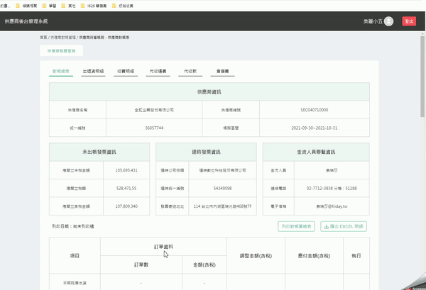
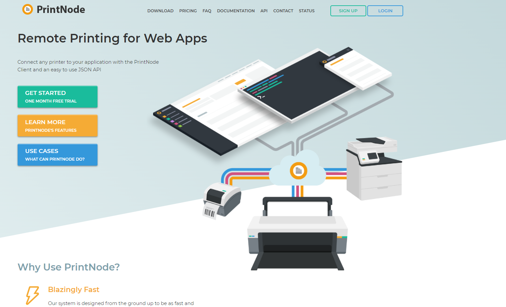

# 前端列印的那些事

雖然明年 2022 年 , 推行公司無紙化也有許多年頭了 , BUT 由於稽核 . 會計 ...等原因 , 
我們還是需要將紙本印出來 , 然後給主管簽名蓋章

身為前端人員當然有時也會被要求幫忙處理列印的相關事情 , 當我開始處理後 , 發現這個 issue 真的是不太容易的事

因此在此紀錄 , 免得自己的金魚腦 , 1 個月後就全部忘記 `當初` 到底是如何處理的

## 釐清目標

需求是要印出下方的

接到這個需求時 , 我初步將問題大概切分成 2 塊 , 來思考 "前端要如何處理 ?"

- 問題一 : 如何將列印的 Panel 開啟 , 並設定要列印的目標 & 其他列印設定
- 問題二 : 如何產生一個固定成 A4 直向 or 橫向的目標 ( PDF )

當然 , 如果有後端可以幫忙產 PDF 的話 , 問題二 , 就可以當不存在 , 因為可以叫後端會幫忙處理這塊 ㄎㄎ 😊

## 用 JS 開啟瀏覽器的列印介面

[MDN](https://developer.mozilla.org/zh-TW/docs/Web/API/Window/print) 上只有寫 `window.print()` 然後就沒了 !

這...

可是我希望列印目標的區塊啊!

再進一步查詢後 , 我們可以發現有個 [printJS](https://printjs.crabbly.com/) 

它可以 列印 `PDF` . `HTML` . `IMAGE` . `JSON` , 這就是我們需要的

```javascript
/*** code snippets ***/
// 列印 PDF 
printJS('docs/printjs.pdf')
printJS({printable: base64, type: 'pdf', base64: true})
printJS({printable:'docs/xx_large_printjs.pdf', type:'pdf', showModal:true})

// 列印 HTML 
printJS('printJS-form', 'html')
printJS({ printable: 'printJS-form', type: 'html', header: 'PrintJS - Form Element Selection' })

// 列印 IMAGE 
printJS('images/print-01-highres.jpg', 'image')
printJS({printable: 'images/print-01-highres.jpg', type: 'image', header: 'My cool image header'})
printJS({
    printable: ['images/print-01-highres.jpg', 'images/print-02-highres.jpg', 'images/print-03-highres.jpg'],
    type: 'image',
    header: 'Multiple Images',
    imageStyle: 'width:50%;margin-bottom:20px;'
})

// 列印 JSON 
printJS({
    printable: someJSONdata,
    properties: [
        { field: 'name', displayName: 'Full Name'},
        { field: 'email', displayName: 'E-mail'},
        { field: 'phone', displayName: 'Phone'}
    ],
    type: 'json'
})
```

太棒了 ! 利用列印指定的區塊 , 我們就可以列印目標的 `HTML` or `PDF` 了 !



可是...列印參數要如何指定阿 ? 


瀏覽器沒有提供控制 print 的相關參數設定 orz

如果要指令列印時的 "雙面列印" . "只印第三頁" ...等設定 , 我們只能使用 "印表機的 API" 來處理

懶得自行開發的話 , 可以用 [printnode](https://www.printnode.com/en) 或是 [Printer Admin](https://www.printeradmin.com/products/) , 這些工具已經將常見的印表機都整合了 !




~~有一說一 , printnode 的官網比 Printer Admin 漂亮 🎈~~

---

## 前端 JS 建立 PDF 

[printJS](https://printjs.crabbly.com/) 提供了幾種可列印的格式

- Images : 列印圖片
- HTML   : 列印 PDF
- PDF    : 列印 PDF
- Json   : 將輸入的資料 , 用 Table 呈現印出

因此我們有 `圖片` . `HTML` . `PDF` 產生 A4 頁面 , 三種選項

但是 , 只有 PDF 能控制列印的是 A4 , 其他 2 種沒法精確的定義大小為 A4 (只能抓 A4 尺寸 , 用 px 模擬)

接下來讓我們用 [jsPDF](https://github.com/parallax/jsPDF) 來幫助我們產生 PDF 吧 !

列印出來的文字會糊糊的 , 這時就可以加 { scale : 4 } 讓 html2canvas 拍出來的文字不再糊糊的


---

1. 都丟給後端處理
2. 請後端傳輸 PDF 到前端 , 由前端打開瀏覽器的列印介面
3. 前端製作 html . css 以符合列印的格式 , 請使用者列印出來 
4. 根據第三點的 html . css 產生圖片 , 並直接打開瀏覽器的列印介面
5. 前端 coding 一份 pdf , 並直接打開瀏覽器的列印介面

---

如果需要 

叫出列印介面 , 我們可以利用 [printJS](https://printjs.crabbly.com/) 這個套件來輔助處理

比如說 , 直接列印 html 表單

```javascript
printJS('formId', 'html')
```

或是直接列印後端回傳的 PDF 檔案

```javascript
printJS({printable: base64, type: 'pdf', base64: true})
```

五 . 前端 coding 一份 pdf , 並直接打開瀏覽器的列印介面

這時我們就需要用 [jsPDF](https://github.com/parallax/jsPDF) 建立我們要列印的 pdf 

```javascript
// 使用的套件有 html2canvas . jsPDF . printJS
class PrintCtrl {

    _doScreenshot = async target => {

        const canvas = await html2canvas(target, { scale: 4 })

        return canvas.toDataURL('image/jpeg')
    }

    _getBase64Pdf = (images = [], orientation) => {

        const orientationMapper = {
            landscape: 'l',
            portrait: 'p',
        }

        // add image to pdfJS , A4 = 210 x 297 mm , jsPDF 官方範例 : http://raw.githack.com/MrRio/jsPDF/master/
        const pdf = new window.jspdf.jsPDF(orientationMapper[orientation], 'mm', 'A4')

        for (let i = 0; i < images.length; i++) {

            // addImage 後兩個引數控制新增圖片的尺寸，此處將頁面高度按照a4紙寬高比列進行壓縮
            if (orientation === 'portrait') pdf.addImage(images[i], 'JPEG', 10, 10, 190, 285)
            else pdf.addImage(images[i], 'JPEG', 10, 10, 285, 190)

            if (i < images.length - 1) pdf.addPage() // addPage 後的 addImage 會參考第二頁的 x . y 軸
        }

        // 產生 data:content/type;base64, 的字串
        const uriString = pdf.output('datauristring')

        return uriString.split('base64,')[1]
    }

    _printIt = async (iframeBody, orientation) => {

        const images = await Promise.all($(iframeBody).find('.main').toArray().map(target => this._doScreenshot(target)))
        printJS({ printable: this._getBase64Pdf(images, orientation), type: 'pdf', base64: true })
    }

    _appendIframe(target, url) {

        const $iframe = $(`<iframe width='670' height='1040' src='${url}' title='print page' frameborder='0'></iframe>`)
        $iframe.get(0).style = 'position: fixed;z-index: -3;opacity: 0;'
        $(target).append($iframe)

        return $iframe
    }

    /**
     * 直接打開列印 Panel , 列印 A4 頁面
     * @param target
     * @param url
     * @param orientation A4 方向 , 有 landscape = 橫式 . portrait = 直式
     */
    print({ target = '#right-side > .header-wrapper + .content .main', url, orientation = 'portrait' } = {}) {

        if (!target) throw new Error('iframe cannot append be undefined target')

        const $iframe = this._appendIframe(target, url)

        // $iframe 的 body 載入完成後 , 才做列印的動作
        $iframe.get(0).onload = () => {

            setTimeout(() => {

                const iframeBody = $iframe.get(0).contentWindow.document.body
                this._printIt(iframeBody, orientation)
                    .then(() => {
                        console.log('success open print dialog')
                        $iframe.remove()
                    })
                    .catch(console.error)

            }, 100)
        }
    }
}
```

## 參考資料

- [Javascript 將 html 轉成 pdf ,下載,支援多頁哦（html2canvas 和 jsPDF）](https://codertw.com/%E5%89%8D%E7%AB%AF%E9%96%8B%E7%99%BC/26393/)
- [iframe 的安全性(一)](https://codertw.com/%E7%A8%8B%E5%BC%8F%E8%AA%9E%E8%A8%80/716274/)
