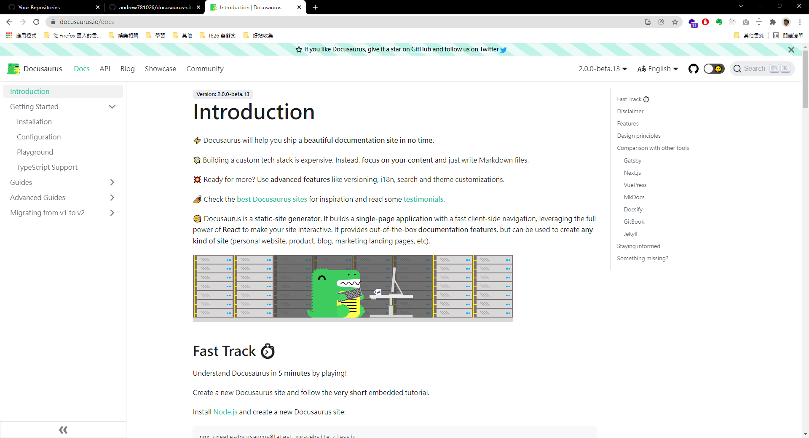

# docusaurus 學習筆記

[docusaurus](https://docusaurus.io/docs) 是一套基於 react 官方支持的文件架站工具 ( 等同於 VuePress )



如果常常需要跟其他工程師說明一些 code 如何使用 , 要去哪找 sample code , 

也許可以架設一個 `文件中心` 來將需要說明的事情 , 放到這個中心

下面我們就來快速建立 , 我們的第一個文件網站 , 讓其他工程師了解我們寫的 tool.js 如何使用 😎

### 安裝

```shell
~$ npx create-docusaurus@latest my-website classic
```

> 設定 `docs` 資料夾建立 md 筆記

在 `docusaurus.config.js` 中設定資料夾 `docs` 

```javascript

```
