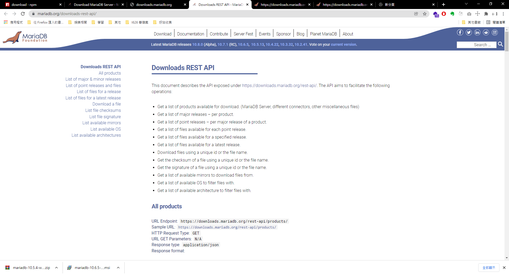
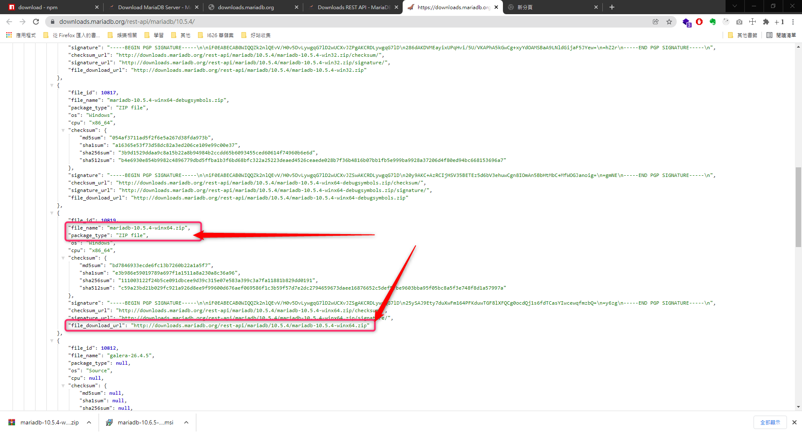
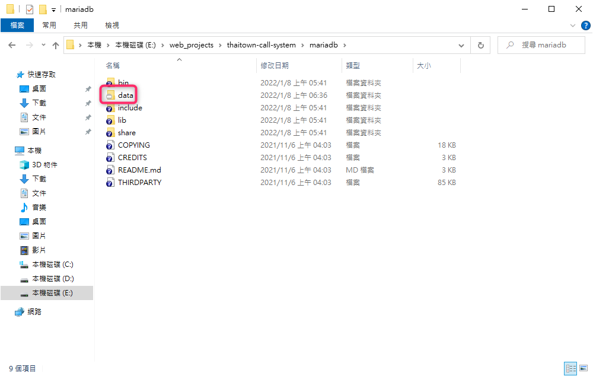

# 下載與安裝 Mariadb 的 Windows ZIP 檔案

在 Mariadb 官方網站中 , 他提供了[下載用的 rest-api](https://mariadb.org/downloads-rest-api/)



我們可以利用 rest-api 下載對應的 Maria Server 來進行安裝

今天我們來下載 & 安裝 Windows Zip 版本的 Maria Server

### 1.下載 Windows Zip 版本的 Maria Server

- 利用 `https://downloads.mariadb.org/rest-api/mariadb/[version]/` 來找出對應版本的下載連結



以 win64 的 Windows 為例 , 我們就可以用 `http://downloads.mariadb.org/rest-api/mariadb/10.6.5/mariadb-10.6.5-winx64.zip` 來下載 `10.6.5` 版本的 Mariadb

### 2.安裝 Windows Zip 版本的 Maria Server

- 解壓縮 Windows Zip 到 mariadb 的資料夾
- 安裝 mariadb

```shell
~$ cd mariadb\bin
~$ mysql_install_db.exe 
```

安裝完成後 , 會產生一個 mariadb\data 的資料夾



- 啟動 mariadb

```shell
~$ mysqld.exe --console
```

- 關閉 mariadb

```shell
~$ mysqladmin shutdown --port=3306 -uroot 
```
