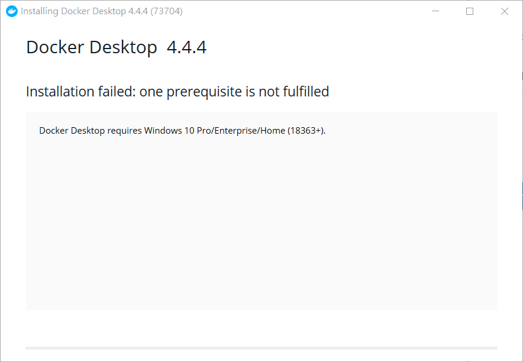

# [NEW] 安裝 Docker Desktop 到 Win10 Home 版

新版的 Docker Desktop 已經可以安裝到 Win10 Home 版了 !

下面我們來看一下 , 有什麼限制 & 要如何安裝吧 !

- Note 1 : 需要 Win10 Home 18363+ 的版本才能安裝 

將 win10 更新到最新版後 , 安裝 & 下一步.下一步...

安裝後有機率發生 , WSL2 無法開啟的狀況

-> 安裝 Linux 核心更新套件 : https://wslstorestorage.blob.core.windows.net/wslblob/wsl_update_x64.msi

來將 WSL2 安裝起來 ( 請勿從 window store 安裝 , 那裏的 WSL2 目前不太穩定 )

步驟 4 - 下載 Linux 核心更新套件

https://docs.microsoft.com/zh-tw/windows/wsl/install-manual#step-4---download-the-linux-kernel-update-package
