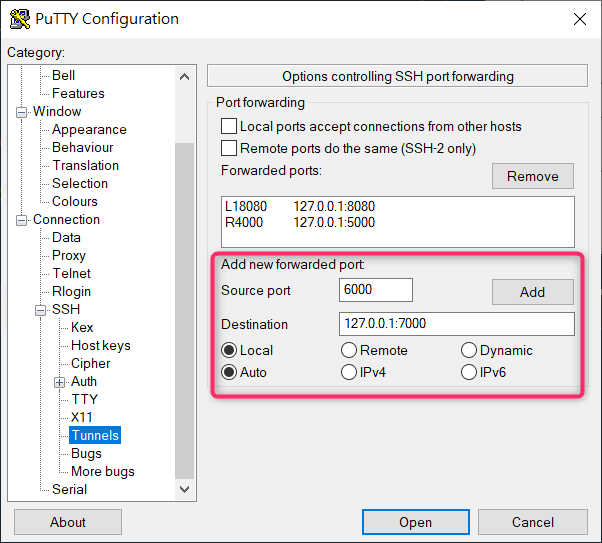

# SSH tunnel - SSH Port Forwarding 

之前在五倍紅寶石 , 看到了自製 Ngrok , 每次在設定 ssh tunnel 的時候都會卡住設定很久 , 因此決定做個筆記

下面是我用 putty.exe 設定 ssh tunnel , 並參考 [SSH Tunneling (Port Forwarding) 詳解](https://johnliu55.tw/ssh-tunnel.html) 上的圖片做出一份筆記

> 感謝 johnliu55 詳細的說明，讓人更清楚 SSH Port Forwarding 要如何使用

## 前置準備

- 在 Digital Ocean 上開啟一台 Droplet 機器 ( 已安裝 Node.exe )
- Putty.exe
- 你的筆電 ( 已安裝 Node.exe )
- [server.js](https://github.com/andrew781026/dev-notes/blob/master/2022-02-25/server.js)

## 什麼是 SSH Port Forwarding ? 

這是一個將 source 的 Port 利用 SSH tunnel 轉送到 target 的另一 port 的一個功能


> Port Forwarding 總共分 3 類

- Local Port Forwarding
- Remote Port Forwarding
- Dynamic Port Forwarding

下面來說明一下 , 各類型是什麼 & 如何使用 ?

### Local Port Forwarding

你電腦上的 Port 6000 可以導向到 將防火牆後伺服器的特定 Port 7000


#### SSH 指令

```shell
~$ ssh -L [bind_address:]<port>:<host>:<host_port> <SSH Server>
```

#### Putty 設定 

Connection > SSH > Tunnels > Local


- `<port>` = 你電腦上的 Port
- `<host>` = 防火牆後伺服器的 host_name
- `<host_port>` = 防火牆後伺服器的 port

#### 實際操作

目標 : 你電腦上的 Port 6000 可以訪問在 將防火牆後伺服器 Port 7000 的 Http Server

> 步驟一. 設定 Putty 的 SSH Tunnel 來連線

 

> 步驟二. 在防火牆後伺服器上啟動 server.js on Port 7000

啟動 server.js

```shell
~$ node server.js 7000 
``` 


確認 Port 7000 正常服務

```shell
~$ curl http://localhost:7000
``` 


> 步驟三. 測試你電腦上 Port 6000 是否可以做訪問


如果遠端 & 本地端都有 2 台電腦

利用 SSH 建立一個通道 (Tunnel) 我們稱為 SSH tunnel

### 將筆電端的 6000 port 轉到 雲端機器的 7000 port (使用 Local 設定 Port Forwarding)

> 等同於 SSH 指令 `ssh -L [bind_address:]<port>:<host>:<host_port> <SSH Server>`



在 "雲端機器" 用 node 在 7000 port 上啟動 server.js


由於 ubuntu 預設會將外部訪問 port 做關閉 , 因此需要將其打開才能做 port forwarding

> Local 的設定會將筆電的 6000 Port 導向 雲端機器的 7000 Port , 不過反過來沒有 X

在雲端機器上啟用 7000 port 的 server.js , 在筆電上 6000 port 會取到資料


使用 Remote 設定 Port Forwarding


用 putty 連上後你可以發現執行在本筆電 port 5000 的服務 , 被轉址到 `雲端主機` 的 4000 port 上了 ! 

雲端機器 :4000 -> 筆電 Private IP :5000 ( 用瀏覽器訪問 雲端機器_hostname:4000 時可以看到 "筆電 :5000" 的頁面 )

當我們用 `curl http://localhost:4000` 測試的時候 , 可以訪問到筆電中 port 5000 的 server 


------


## 參考資料

- [ngrok 不求人：自己搭一個窮人版的 ngrok 服務](https://5xruby.tw/posts/easy-ngrok-by-nginx-ssh-tunnel)
- [SSH Tunneling (Port Forwarding) 詳解](https://johnliu55.tw/ssh-tunnel.html)
