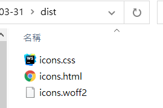
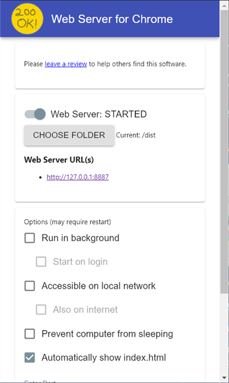
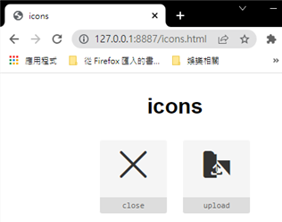

# 建立自己的 font-icon 合集 - [fantasticon](https://github.com/tancredi/fantasticon)

當你設計完成許多的 Icon 並將其匯出成許多的 SVG Icon , 那你要如何將其轉換成 Icon Fonts

讓其他工程師像 font awesome 一樣簡單的安裝 & 使用 , 你設計的呢 ?

抱著這個疑問 , 我展開了研究 , 找到了 [fantasticon](https://github.com/tancredi/fantasticon) 這個工具

下面讓我們來看看這個工具如何使用吧 !

## 準備 SVG 小圖示

如果你會設計 , 當然可以將你 Figma 或 XD 中的 icon 匯出成 SVG 檔案

不過手殘如我 , 當然是使用現成的 SVG 來使用 （￣︶￣）↗

我一般會到 [flaticon](https://www.flaticon.com/) 網站上找需要的 icon , 然後下載

這次的範例 就用 `CLOSE.SVG` 跟 `UPLOAD.SVG` 這兩個 SVG 檔案吧 !


準備好 SVG 檔案 , 接下來我們進入今天的主題 `fantasticon API`

```
!!!! fantasticon 有兩種使用方式 !!!!
- 利用 CLI ( 用指令來生成 )
- 利用 Program API ( 利用程式碼來生成 , 我們採用的方式 )
如果想了解更多細部內容 , 可以看官方文件(https://github.com/tancredi/fantasticon) , 來了解如何使用
```

## 安裝 & 使用 fantasticon API

第一步 , 安裝 fantasticon 套件

```shell
~$ npm init -y           # 快速建立 package.json
~$ npm i -s fantasticon  # 安裝 fantasticon 套件
```

第二步 , 建立 `generator.js` 用於生成 font-icon

```javascript
// generator.js 
const {generateFonts, FontAssetType, OtherAssetType} = require('fantasticon');

// 官方文件 : https://www.npmjs.com/package/fantasticon#api
generateFonts({
    name: 'icons',
    inputDir: './svgs', // 放置 SVG 的資料夾位置 (required)
    outputDir: './dist', // 放置輸出檔案的資料夾 (required)
    fontsUrl: '',
    fontTypes: [FontAssetType.WOFF2], // font icon 格式 : eot . woff . woff2 . ttf . svg 
    assetTypes: [
        OtherAssetType.CSS,
        OtherAssetType.HTML
    ],
    formatOptions: {json: {indent: 2}},
    templates: {},
    pathOptions: {},
    codepoints: {},
    fontHeight: 300,
    round: undefined, // --
    descent: undefined, // Will use `svgicons2svgfont` defaults
    normalize: undefined, // --
    selector: null,
    tag: 'i',
    prefix: 'icon',
}).then(results => {
    console.log('generate Fonts successfully')
});
```

請將 SVG 檔案放到 svgs 資料夾中 , 然後會呈現下圖所示的檔案結構

```
workspace
  ├─dist
  ├─svgs
  │  ├─close.svg ( 叉叉圖示 )
  │  └─upload.svg( 上傳的圖示 )
  ├─generator.js
  └─package.json
```

將檔案放在對應位置後 , 我們就可以執行 `node generator.js` 來產生 font-icon

執行後 , 我們可以觀察到 `dist` 資料夾中多了 3 個檔案 `icons.css` .  `icons.html` .  `icons.woff2`



接著我們可以使用 [Web Server for Chrome](https://chrome.google.com/webstore/detail/web-server-for-chrome/ofhbbkphhbklhfoeikjpcbhemlocgigb)
這個插件 , 來查看 `icon.html`



並訪問 http://127.0.0.1:8887/icons.html 來觀察生成的 icon



```
!!!! 注意事項 !!!!
上方我們看得很清楚 , 彩色的 Icon - upload.svg 有明顯的破圖
如果需要使用 fantasticon 來建立 font-icon 請使用黑白的 SVG 避免意外的破圖產生 
```

### 那生成的 font-icon , 要如何在 html 中引入呢 ?

在目標 html 中引用 `icons.css` 並將 `icons.woff2` 複製到對應位置

我們就可以使用 font-icon `<i class="icon icon-close"></i>` 了 !

### 使用範例

- 資料夾結構

```
folder
  ├─icon.css  
  ├─icon.woff2 
  └─example.html
```

- 範例 HTML

```html
<!-- example.html -->
<!DOCTYPE html>
<html lang="zh-tw">
<head>
    <meta charset="UTF-8">

    <!-- 引用 icons.css -->
    <link rel="stylesheet" type="text/css" href="icons.css"/>

    <style>
        i {
            font-size: 40px;
        }

        .text-red {
            color: red;
        }

        .text-green {
            color: green;
        }

        .text-blue {
            color: blue;
        }
    </style>
</head>
<body>
<i class="icon icon-close"></i>
<i class="icon icon-close text-red"></i>
<i class="icon icon-close text-green"></i>
<i class="icon icon-close text-blue"></i>
</body>
</html>
```

### 參考資料

- [fantasticon](https://github.com/tancredi/fantasticon)
- [flaticon](https://www.flaticon.com/)
